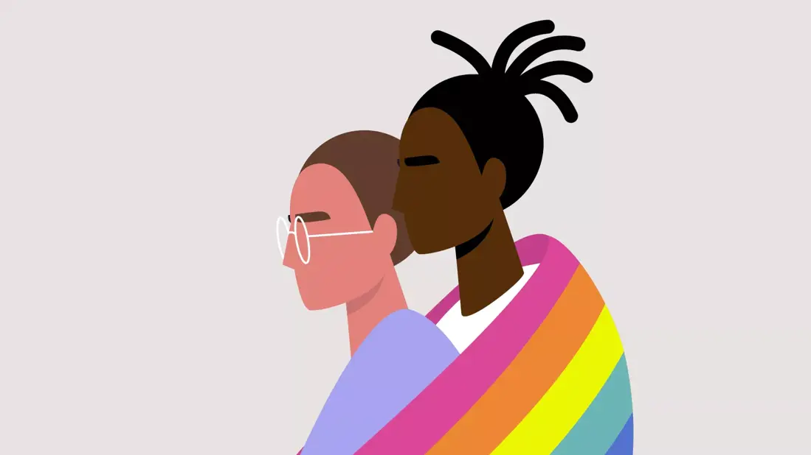

# What Is Sexual Orientation?
> 원문을 읽고 싶으신가요? [여기](https://health.clevelandclinic.org/types-of-sexual-orientation)를 확인해보세요.

Sexual orientation exists on a spectrum and can result in a wide range of relationships

\
Discovering your sexual orientation begins with an internal awareness of attraction. How you find comfort in expressing or acting on your sexual orientation varies based on your experiences and cultural upbringing.

“Sexual attraction is internally driven,” says pediatric psychologist [Vanessa K. Jensen, PsyD, ABPP](https://my.clevelandclinic.org/staff/643-vanessa-jensen). “For some individuals, it is very clear who they are attracted to. For others, it takes having some experience in relationships to really figure out who you are.”

But that doesn’t mean you have to have sex in order to understand you’re attracted to someone. Some people might know their sexual orientation from an early age. Others might discover their sexual orientation evolves and changes over time. Sexual orientation can be fluid, and who you’re attracted to now might not be who you’re attracted to later in life.

For many young people, especially in their teenage years, Dr. Jensen says exploring your sexual orientation is part of figuring out who you are while accepting those traits in those around you.

Plus, attraction can be split into two categories: Romantic attraction, which is an emotional connection to the partner you’re interested in; and sexual attraction, which includes a physical component. On the surface, it’s easy to assume that romantic attraction and sexual attraction occur at the same time, but that’s not always the case. You may experience different degrees of romantic and sexual attraction with different people for different reasons. Some people never experience romantic desire and some people never experience sexual attraction. Understanding that these feelings can change over time is crucial for young people who’re interested in exploring what it means to be attracted to other people.

“These terms aren’t always lifelong labels,” says Dr. Jensen. “People can change how they feel over time.”

## **Sexual orientation and how we talk about attraction**
Your sexual orientation can exist on a wide spectrum resulting in different kinds of relationships. You might even find that your sexual orientation falls into [more than one category](https://pubmed.ncbi.nlm.nih.gov/23469819/).

What’s more, it’s important to understand how our sexual orientations — and our exploration and acceptance of our sexual orientations — are directly linked to our overall health. Historically, members of the LGBTQ+ community have experienced [high levels of fear](https://pubmed.ncbi.nlm.nih.gov/35206306/) of discrimination, violence and rejection, often as a result of social stigma and persecution.

Many LGBTQ+ youth who’ve experienced bullying, violence and discrimination from family members, friends and other members of the public have reported dealing with anxiety, depression, suicidal ideation and other harmful conditions. According to the 2021 National Survey on LGBTQ Youth Mental Health, The Trevor Project found that [42% of LGBTQ youth seriously considered suicide](https://www.thetrevorproject.org/survey-2021/) in the previous year. Additionally, 75% of LGBTQ youth experienced some form of discrimination based on their sexual orientation at least once in their lifetime.

As we explore how we identify — and as we allow others, especially our children, to explore how they identify — it’s important that we create a safe space for experimentation and acceptance by [offering support and creating safe networks](https://pubmed.ncbi.nlm.nih.gov/35181244/) with trusted family members, friends and organizations.

“In finding your identity as a person, part of that is often asking, ‘Who am I attracted to?’” notes Dr. Jensen. “Parents should give kids permission to explore a lot of these identities but give them even more permission to let them be fluid because it’s part of figuring out who they are.”

The following list may not be all-inclusive, but here are a number of different sexual orientations to consider (nearly all of which have romantic orientations, too):

### **Androsexual**
This term is used to describe a person who’s attracted to men or masculinity. This term is inclusive of all people who are masculine regardless of their [sex recorded at birth](https://my.clevelandclinic.org/health/articles/sex-recorded-at-birth).

### **Asexual**
Also known as “ace,” [asexual](https://health.clevelandclinic.org/asexual/) describes someone who has little to no sexual attraction toward other people. And because sexual orientations are on a spectrum based on someone’s personal feelings and experiences, asexuality can vary in a lot of ways.

For example, you might not experience sexual attraction, but your personal relationship with sexual behavior can differ in the following ways:

- **Sex-favorable:** This means you have positive feelings about some types of sexual activity in some situations.
- **Sex-averse:** This means you may not want to engage in any sexual behavior.
- **Sex-repulsed:** If you’re sex-repulsed, you typically don’t like to be subjected to sexual content of any kind (in conversation or in movies and on TV) or you don’t like the idea of sex.
- **Sex-indifferent:** You can also feel neutral about sex and sexual behavior.

There are many other subcategories of asexuality, too. You can identify as **cupiosexual**, which means you don’t experience sexual attraction, but you desire to engage in sexual behavior or a sexual relationship. Or you can identify as **graysexual**, which means your level of sexual attraction to someone changes over time or isn’t always present or intense.

Also, there’s the aromantic orientation, which describes someone who experiences little to no romantic attraction to other people.

“There may be some people who are asexual who feel like they’re attracted to someone as a life partner or in a way that’s different than a friend,” says Dr. Jensen. “They may want to be monogamous with them, or they like to cuddle with them and have some physical connection, but they may not want sexual intercourse or certain sexual activities.”

### **Bicurious**
This term typically describes someone who's attracted to males and/or females but may be exploring their sexuality and hasn’t yet determined their sexual orientation. It's possible you’ve yet to land on any one identity either because you’ve had limited experiences or because you’re not quite ready to make that claim for any number of reasons.

### **Bisexual**
Historically, this term describes someone who experiences emotional, sexual or romantic attraction to both males and females. Being bisexual doesn’t mean you always experience sexual attraction to other people equally. And being in a relationship with someone does not necessarily mean you’re no longer bisexual.

“Who you’re with doesn’t always define how you identify,” says Dr. Jensen. “You can be bisexual and married to a heterosexual partner.”

### **Demisexual**
If you’re demisexual, you may only find someone sexually attractive if you’ve developed an emotional or romantic connection with them. For many who identify as demisexual, they may hold off on participating in sexual activity until they’ve developed that emotional and romantic connection.

“In our culture now, which is much more open about sexuality and sexual experiences, someone can define themselves as demisexual and it makes it very clear from the beginning, ‘We’re not going to hook up on the first date,’” says Dr. Jensen.

### **Fluid**
This term means your sexual orientation could shift or change over time. How you identify today as an individual may not be how you identify in a couple of months as feelings evolve and our understanding of ourselves becomes clearer. How you feel about someone else can also evolve, including your sexual, emotional or romantic attraction to different people.

### **Gay**
This term typically describes someone who experiences emotional, sexual or romantic attraction to people of the same sex. This term is sometimes used specifically referring to men who are attracted to other men, but it's also used for women attracted to women. Historically, the medical community used the term homosexual, but that’s largely considered an outdated term by many members of the LGBTQ+ community because of its history of marginalization — or the act of being excluded or considered of little consequence.

### **Gynesexual**
This term is used to describe a person who’s attracted to females or femininity. This term is inclusive of all people who are feminine regardless of their sex recorded at birth.

### **Heterosexual**
Also known as “straight,” this term is used to describe a person who experiences emotional, sexual or romantic attraction to people of the opposite sex. Some may find the term “straight” derogatory, as it implies any orientation that’s not heterosexual is wrong in some manner.

### **Lesbian**
This typically describes a woman who experiences emotional, sexual or romantic attraction to other women.

### **Pansexual**
A synonym of omnisexual, this term describes anyone who experiences emotional, sexual or romantic attraction to others regardless of who they are.

### **Queer**
This is an umbrella term that describes anyone who isn’t exclusively heterosexual. This term implies you may fall anywhere on the spectrum. Some may view this as a derogatory term. But many have reclaimed this term as an affirming description for all LGBTQ+ individuals.

### **Questioning**
If you’re unsure about your sexual orientation, or if you’re actively exploring what your sexual orientation is, you may fall into this category.

“This kind of term can be helpful to a young person who feels like everyone else around them is labeling themselves and they don’t know who they are yet,” says Dr. Jensen. “You can be uncertain and that’s totally OK to be uncertain.”

## **Knowing when to tell others about your sexual orientation**
So, how do you know when you should disclose your sexual orientation to others? And who do you tell?

This process, known as “[coming out](https://health.clevelandclinic.org/how-to-come-out)” or “coming out of the closet,” can take years for someone to be comfortable and confident enough to do. For many people in the LGBTQ+ community, coming out happens in a variety of ways through conversation, experiences and moments you share with others — and you can come out to multiple people over the course of your lifetime, as things change or as you meet new people in new situations. The coming out process can be simple for some and a big deal for others.

Coming out looks different for everyone, but some situations may include:

- Disclosing your sexual orientation to a friend, family member or partner
- Publicly identifying as LGBTQ+ online or in person
- Sharing stories or experiences with others that express your sexual orientation
- Introducing your romantic or sexual partner to friends or colleagues

There’s no right way to come out to others about how you identify. The important thing is that you do it on your terms **when you’re ready**. For many people in the LGBTQ+ community, safety and acceptance are large concerns that should be taken into consideration when deciding whether or not to come out about how you identify. Sexual orientation can be much more private until you are in a romantic and/or sexual relationship.

“Sometimes, people wait to come out until a natural opportunity shows up,” says Dr. Jensen. “For teens, it’s a matter of deciding who to tell, when to tell them and how to tell them, and it may vary based on your situation. Many individuals ‘come out’ to friends and family in order to be closer to them, as a way of being more genuine and to share this important part of their identity.”

For others, especially if you’re living in an area where it’s unsafe to disclose your sexual orientation, you may choose to stay **closeted**. If you’re closeted, you may be open about your sexual orientation with those who are close to you but not the world at large. Sometimes, this is referred to as “stealth” or “being on the DL” (down low). You may choose to remain closeted out of fear of discrimination, rejection, violence or mistreatment — or you may simply not want to share that information with anyone (your sexual life does not need to be anyone else’s business).

It’s important to know that if you are closeted, you’re still valid. You should never feel rushed or pressured to disclose personal information to anyone. And if you’re ever feeling unsafe, several resources are available to you.

Regardless of how you identify or what stage of the journey you’re in, it’s important to recognize that the feelings you’re experiencing are normal and you’re not alone in how you feel. You are valid, no matter who you’re attracted to.
