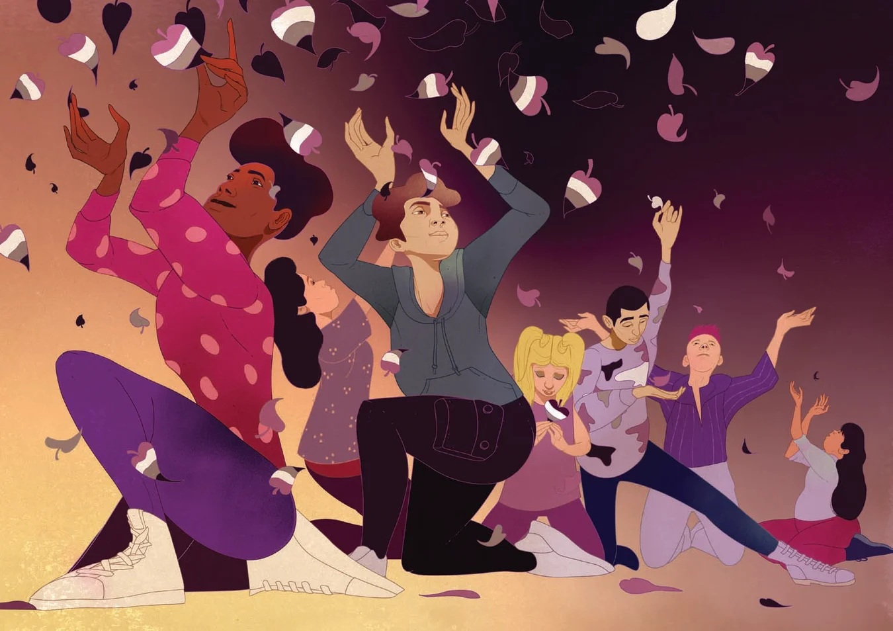

# Asexuality Is Finally Breaking Free from Medical Stigma
New research on asexuality shows why it’s so important for doctors and therapists to distinguish between episodes of low libido and a consistent lack of sexual attraction

By [Allison Parshall](https://www.scientificamerican.com/author/allison-parshall/)

> 원문을 읽고 싶으신가요? [여기](https://www.scientificamerican.com/article/asexuality-is-finally-breaking-free-from-medical-stigma/)를 확인해보세요.

In graduate school people often asked Megan Carroll whether she was gay. Her sociology dissertation was on inequalities within communities of gay fathers, so her research participants were curious about how she identified. “I would say, ‘Oh, I'm maybe mostly straight? I don't really know. It's complicated.’” It was, at the time, the closest she could get to the truth. She'd had crushes on both boys and girls in high school and had been in a relationship with a man; being around her romantic interests sent her heart fluttering in her chest. But nothing like that happened when she considered having sex with any of them—she simply wasn't interested. Her friends assured her she just needed to meet the right person, someone who would light her fire.

When that hadn't happened by the time she was 18, Carroll thought she might simply have a low libido and went looking for an explanation. Thinking her birth control might be to blame, she spoke with a nurse, who suggested that perhaps her boyfriend was “just a bad lover.” Then Carroll wondered whether it was the pills she was taking to treat her depression. Over the next 12 years she visited multiple therapists, psychiatrists and physicians and tried different antidepressants—including a less commonly prescribed drug that gave her tachycardia, or a faster heart rate. Eventually she settled on one that had shown no measurable effect on sex drive in clinical trials.

Throughout these years of experimentation, Carroll's libido—the physiological desire for sexual stimulation and release—did fluctuate. But what remained constant was that her libido was rarely, if ever, directed at another person, even her crushes.

In 2016 Carroll stumbled on a Facebook post about asexuality. She'd heard the term, typically defined as experiencing little to no sexual attraction, but had never felt that it applied to her. Then Carroll read a comment that mentioned demisexuality, a specific experience of feeling sexual attraction only after developing an emotional bond with someone. The idea that asexuality was a spectrum opened an entire world that had never been discussed in her gender and sexuality courses—one in which sexual desire was not necessary for a fulfilling life.

Because this idea subverts a cultural assumption about what it means to be human, it is often difficult for asexual people to recognize, let alone embrace, their identity. “Your very existence is, in some way, in opposition” to the societal norm, says CJ Chasin, an asexual gender and sexuality scholar at the University of Windsor in Canada. Even after realizing she probably was asexual, Carroll still visited doctors to experiment with her medications before finally accepting that she just is the way she is.

Over the past two decades psychological studies have shown that asexuality should be classified not as a disorder but as a stable sexual orientation akin to homosexuality or heterosexuality. Both cultural awareness and clinical medicine have been slow to catch on. It's only recently that academic researchers have begun to look at asexuality not as an indicator of health problems but as a legitimate, underexplored way of being human.

In biology, the word “asexual” typically gets used in reference to species that reproduce without sex, such as bacteria and aphids. But in some species that do require mating to have offspring, such as [sheep and rodents](https://www.ncbi.nlm.nih.gov/pmc/articles/PMC6787552/), scientists have observed individuals that don't appear driven to engage in the act.

This behavior is more analogous to human asexuality, a concept rarely mentioned in medical literature until recently. In a pamphlet published in 1896, pioneering German sexologist Magnus Hirschfeld described people without sexual desire, a state he called “anesthesia sexualis.” In 1907 Reverend Carl Schlegel, an early gay rights activist, advocated for the “same laws” for “the homosexuals, heterosexuals, bisexuals [and] asexuals.” When sexologist Alfred Kinsey devised his scale of sexual orientation in the 1940s, he created a “Category X” for the respondents who unexpectedly reported no sociosexual contacts or reactions—exceptions from his model whom he estimated made up 1.5 percent of all males between the ages of 16 and 55 in the U.S. Asexuality was largely absent from scientific research over the subsequent decades, although it was occasionally referenced by activists and scholars in the gay liberation movement.

It wasn't until the World Wide Web emerged that asexual people around the globe began finding one another on Internet forums. They started building a shared language in the early 2000s, mapping the landscape of asexuality through a grassroots development of concepts and labels. Calling themselves “aces,” they tended to split sexual and romantic attraction into spectrums of their own; asexual people can experience varying levels of each. Aces can be sex-repulsed, sex-neutral or sex-favorable; they may have sex frequently or never.* There are aces who have high libidos and aces with none to speak of. Some aces masturbate, and others don't. Different as they are, members of the ace community are unified by their relative lack of sexual, and sometimes romantic, attraction to others.

At the time, however, being asexual could be considered indicative of a psychiatric disorder, according to the American Psychiatric Association's _Diagnostic and Statistical Manual of Mental Disorders_ (_DSM_). If someone reported being distressed by their low sexual desire, a doctor could diagnose them with hypoactive sexual desire disorder (HSDD). A person could also qualify for the diagnosis if their partner was upset by their low sexual desire—even if they themselves were fine with it. In other words, the person in a couple “who didn't like sex enough had the disorder,” explains David Jay, founder of the Asexual Visibility and Education Network (AVEN), an online forum that became a starting point for much of the ace community.

Levels of sexual desire can fluctuate throughout life for many reasons that may or may not be a cause for medical concern, including changes to hormone levels or mental health. If someone is experiencing significant distress about a dip in desire, they may benefit from diagnosis and treatment. But asexual people tend to experience their lack of sexual attraction to others as a relatively stable orientation rather than a disorder requiring intervention. So when work began on an updated version of the _DSM_ in the late 2000s, Jay and others at AVEN wanted to make this clear to the scientists drafting it. “We wanted researchers to, at the very least, understand how we think about ourselves before they interpret data about us,” Jay says. The AVEN team conducted a review of the literature and interviewed seven researchers, most of them psychologists.

AVEN put its findings in a report and sent it to the committee in charge of reevaluating the HSDD diagnostic criteria for the _DSM_'s fifth version. One committee member was Lori Brotto, a psychologist at the University of British Columbia who was conducting some of the earliest studies of asexuality. Brotto found that AVEN's report aligned well with what she was already learning from her research, which compared the behavior, experiences and physiological responses of self-identifying asexual people with those of nonasexual people who had received an HSDD diagnosis. She consistently found differences in responses among the asexual group that suggested asexuality shouldn't be categorized as a sexual dysfunction.

In 2013 the _DSM-5_ was published with a revamped section on sexual dysfunction that split HSDD into male and female disorders with new names. Each one contained a line specifying that someone who identifies as asexual should not be given the diagnosis. This change meant that asexuality was no longer a disorder in the eyes of the American Psychiatric Association, and it opened up new ideas for researchers investigating sexual desire.

The study of asexuality [developed](https://pubmed.ncbi.nlm.nih.gov/27542079/) throughout the mid-2010s and is now growing rapidly, says Jessica Hille, a gender and sexuality researcher at Indiana University's Kinsey Institute. In a review published in November 2022, Hille found 28 studies on asexuality published between January 2020 and July 2022, “whereas 10 years ago I don't know that you would have found 28 papers in the [entire] field,” she says.

Today “asexuality is widely accepted as a sexual orientation in the literature,” Hille says, but cultural awareness remains in its infancy, especially compared with other orientations under the LGBTQIA+ umbrella. Saying you don't experience sexual attraction is still like saying you don't eat, Hille explains, and “if you don't eat, there's something wrong with you, and you're hurting yourself.” Asexual people sometimes get this message not just from family and acquaintances but from their health-care providers.

Shelby Wren, a health equity researcher at the University of Minnesota, published a study in 2020 in which [30 to 50 percent](https://link.springer.com/article/10.1007/s10508-020-01670-6) of respondents who had disclosed their asexuality in a medical setting said a therapist or doctor had attributed their asexuality to a health condition. The proposed diagnoses included anxiety, depression and, in one case, a personality disorder. “You don't know what's going to happen when you disclose your sexual orientation,” Wren says. “And for a lot of people, that stops them from talking about things that could be relevant to their health care.”

For Rowan, an actor and writer based in Scotland, who asked to be identified by first name only, this very experience began with a routine appointment with their gynecologist. When the nurse asked whether they were sexually active, they said no—they had a boyfriend but hadn't had penetrative sex. “I don't want to,” Rowan recalls explaining to the nurse. “I don't feel anything. I don't feel ready enough.” Rowan, who was in their early 20s at the time, felt ashamed, “like there was part of me that wasn't right, and I wanted it to be fixed.” The doctor referred Rowan to a psychosexual therapist. In their first therapy appointment, Rowan suggested that they might not be sexually attracted to anyone. They don't recall the therapist mentioning that again over the course of four appointments; instead the therapist suggested a physical exam of Rowan's genitals.

During the internal exam, Rowan felt “nothing” and removed from their body. “That was really confusing for me at the time, that a medical exam is just as cold and devoid of any feeling” as was physical intimacy with their boyfriend. Rowan recalls the therapist reporting that nothing was physically wrong with them and then spending the next few sessions trying to identify Rowan's mental blockage. These encounters had lasting effects on Rowan, including dissuading them from seeking therapy to treat their depression.

Rowan is not alone. In a [report on asexual discrimination](https://www.stonewall.org.uk/resources/ace-report) published in October 2023 by Stonewall, a U.K.-based LGBTQIA+ rights organization, many interviewees reported that low awareness of asexuality had negatively impacted their health care at some point. One participant's therapist told her to set goals to get over her “fear of sex” and to take a medication to increase her libido. Another participant's therapist assumed that her asexuality stemmed from childhood trauma and would change with time, which led the participant to force herself to do things she was not comfortable with. And another participant's doctor assumed her asexuality came from her antidepressants. (While antidepressants have been shown to impact one's physiological desire for sexual release, or libido, there is no evidence that they lower one's sexual attraction to others, which is the component of desire that is most relevant to asexuality, Carroll explains. Some asexual people have never taken these medications, including sources quoted in this article.)

Other stories in the report show what can happen when asexuality becomes the focus of doctor's visits for completely unrelated issues, interfering with treatment and even causing harm. This was an “overwhelming pattern” in the report, says lead author and asexual activist Yasmin Benoit. One participant who was suffering from pelvic pain, for example, described how her general practitioner would not give her a referral to a gynecologist until she first saw a psychosexual therapist. This prerequisite resulted in a seven-month delay in treatment and, according to the participant, “extensive muscular damage.”

Refraining from disclosing one's asexuality to a mental health provider is often a “very rational decision,” Chasin says. “It's always much worse to be actively rejected and misunderstood.” For instance, asexual people are sometimes subjected to conversion therapy, a practice aimed at changing someone's sexuality or gender identity. It is banned for minors in 22 U.S. states because of its well-documented and extensive harms, including increased rates of suicide. A 2018 U.K. government survey of LGBTQIA+ people found that asexual respondents were the most likely to be [offered conversion therapy](https://assets.publishing.service.gov.uk/government/uploads/system/uploads/attachment_data/file/721704/LGBT-survey-research-report.pdf) and as likely as gay and lesbian people to receive it. A recent survey by the Trevor Project found that [4 percent of asexual youths in the U.S.](https://www.thetrevorproject.org/survey-2023/) were subjected to conversion therapy, on par with bisexual respondents.

On the legislative level, bans on conversion therapy should explicitly reference asexuality, Benoit says. So, too, should professional associations of health-care practitioners, says Samantha Guz, a social work researcher at the University of Chicago. “Asexual people are made to be so invisible in our society that I don't think just having a broad call against conversion therapy is specific enough,” Guz says.

Even well-meaning doctors might unwittingly harm their patients. To a clinician, a patient who is worried that they _should_ feel more sexual desire—and who does not know they are simply asexual—might initially look similar to patients who want sexual intimacy and could benefit from treatments aimed at increasing or restoring desire. Treatments for certain types of sexual dysfunction do help some people whose level of sexual desire leaves them distressed and unsatisfied, Brotto says. For some people, though, this distress may be coming not from an intrinsic desire to want sex but from external pressures such as partners or society as a whole. “I have worked with folks where it's taken us many, many months for the person to really understand how well asexuality fits with their identity,” as opposed to having an issue that is rooted in a health problem or a situational condition, Brotto says. Most doctors, though, don't know that such a distinction exists or is necessary, she adds.

Since coming to embrace their asexuality, Rowan has become more comfortable with expressing love and receiving it from friends and partners without the weighted expectations of sex. With their most recent therapist, they finally had a positive experience talking about asexuality in therapy. “She would ask me specific questions about [my asexuality], but she didn't make assumptions about what it meant,” Rowan says.

In early 2022 the American Association of Sexuality Educators, Counselors and Therapists published a position statement on how to care for asexual patients. It says asexuality is not a disorder or a response to trauma and that asexual individuals often face difficulty in finding affirming health care. (Unlike the _DSM_, the World Health Organization's International Classification of Diseases still hasn't specified that asexuality isn't a disorder.) The association opposes “any and all” attempts to change or pathologize someone's asexual orientation and labels such attempts as conversion therapy.

Jared Boot-Haury, a clinical psychologist and certified sex therapist, who drafted the statement, hopes that larger organizations such as the American Medical Association will put forward similar statements and, ultimately, clear and empirically supported guidelines for clinicians.

Meanwhile many studies of asexuality are moving beyond confirming it exists, instead exploring how ace people find intimacy in their relationships and personal fulfillment outside of the cultural scripts for building a life around a sexual or romantic partner. The asexual community has had to reimagine love and relationships to fit its needs; this wisdom could help everyone, asexual or not, Jay says. He cites the U.S. surgeon general's recent report of an “epidemic” of loneliness, which showed how social connection has significantly decreased over the past 20 years.

“Because the ace community was denied the infrastructure of intimacy and had to invent our own, we have become this site of innovation that a lot of people, especially nonqueer people, suddenly are interested in,” Jay says. He is raising a child in a [three-parent family](https://www.theatlantic.com/family/archive/2020/09/how-build-three-parent-family-david-jay/616421/), which was the subject of a 2020 _Atlantic_ article. Jay now counsels people, asexual or otherwise, on how to build intentional relationships outside of cultural norms.

Carroll, now a sociologist at California State University, San Bernardino, also investigates resources for ace people that might apply more broadly. Some of her latest work examines the difficulty that asexual and aromantic people often face in accessing middle-class housing systems, which are built for nuclear family structures that might not be attainable or desirable for many asexual people, she explains.

Having found a home in the ace community both personally and professionally, Carroll now understands the distress that drove her to doctors' offices quite differently. She must have known “deep down inside” that her disinterest in sex wasn't a problem; it's “the rest of the world that's a problem,” she says. Today her students seem so “receptive to asexuality, wanting to learn about what I know.”

It's not just young people who are coming around. When Carroll lectures about asexuality, she often tells a story about her mother, Laura Vogel, a licensed professional counselor who specializes in recovery from sexual trauma. Vogel knew traumatic experiences could decrease someone's desire for sex, but for a long time she didn't know that asexuality could be something entirely separate from that. When Carroll came out as asexual to her mother in 2017, Vogel began reading up on the subject and realized how her lack of awareness might have affected her clients. “That was a learning period for me,” Vogel told me recently. Since then, if a client expresses little to no desire to have sex, she sends them home with resources about asexuality to see whether it resonates.

“If a therapist had done what my mom now does ... it's hard to describe what that would have meant for me personally,” Carroll says. “That awareness can save asexual people years and years of uncertainty.”

*_Editor’s Note (1/5/24): This sentence was edited after posting to replace the term “sex-positive” with “sex-favorable,” which is preferred by many in the asexual community._
